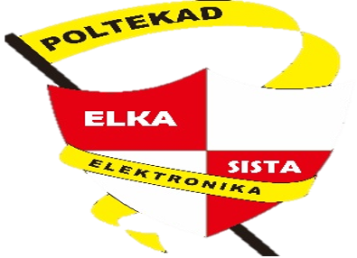

# 🔥 Aplikasi Deteksi Api & Asap

Aplikasi desktop Windows berkinerja tinggi untuk deteksi api secara real-time menggunakan model YOLO-MP.



## ✨ Fitur

- **Deteksi Real-time**: Mendeteksi api dengan akurasi tinggi menggunakan model YOLO-MP.
- **Dukungan Banyak Kamera**: Memindai dan mencantumkan semua webcam yang terhubung secara otomatis.
- **Perekaman & Snapshot**: Rekam klip video (`.mp4`) atau ambil tangkapan layar (`.png`) dengan satu klik.
- **Statistik Langsung**: Menampilkan FPS, jumlah api terdeteksi, dan info model aktif secara real-time.
- **Dioptimalkan untuk CPU**: Dirancang untuk berjalan secara efisien pada CPU standar tanpa memerlukan GPU khusus.

## 🚀 Mulai Cepat

### Prasyarat
- **Windows 10 atau 11** (64-bit)
- **Python 3.11** (Wajib)

### Instalasi

1.  **Clone atau Unduh** repositori ini.
2.  **Jalankan skrip penyetelan otomatis**:
    ```powershell
    python run.py
    ```
    *Catatan: Skrip akan memeriksa Environment Anda dan memberi tahu apa yang harus dilakukan jika ada dependensi yang hilang.*

### Pengaturan Manual (jika diperlukan)

Jika Anda lebih suka mengatur secara manual:

1.  **Buat Virtual Environment**:
    ```powershell
    py -3.11 -m venv venv311 ## untuk menginisiasi virtual environment
    .\venv311\Scripts\activate ## untuk mengaktifkan virtual environment
    ```

2.  **Instal Dependensi**:
    ```powershell
    pip install -r requirements.txt
    ```

3.  **Jalankan Aplikasi**:
    ```powershell
    .\venv311\Scripts\python.exe run.py
    ```

## 🖥️ Panduan Penggunaan

1.  **Pilih Kamera**: Gunakan daftar drop-down untuk memilih kamera input Anda.
2.  **Kontrol**:
    *   **Mulai**: Memulai deteksi AI api.
    *   **Berhenti**: Menjeda deteksi (pratinjau kamera tetap aktif).
    *   **Rekam**: Mengalihkan perekaman video ke folder output.
    *   **Ikon Folder**: Membuka direktori tempat rekaman disimpan.

## 🛠️ Membangun Executable

Untuk membuat file `.exe` mandiri agar mudah didistribusikan:

```powershell
.\venv311\Scripts\activate
.\venv311\Scripts\python.exe build.py
```

File output `FireDetectionApp.exe` akan muncul di folder `dist`.

## 📁 Struktur Proyek

Untuk penjelasan rinci tentang basis kode dan cara kerjanya, silakan lihat [CODE_OVERVIEW.md](CODE_OVERVIEW.md).

## ❓ Pemecahan Masalah

| Masalah | Solusi |
|-------|----------|
| **"No module named..."** | Pastikan Anda mengaktifkan virtual environment (`.\venv311\Scripts\activate`). |
| **Kamera tidak ditemukan** | Klik tombol **"R"** (Refresh). Periksa jika aplikasi lain (Zoom/Teams) sedang menggunakan kamera. |
| **FPS Rendah / Lag** | Buka Settings (⚙️) dan aktifkan Low Spec Mode. Pastikan laptop terhubung ke daya. |
| **Model tidak ditemukan** | Pastikan folder `YOLO-MP-master` ada dan berisi `YOLO-MP.pt`. |

## ⚖️ Lisensi
Lisensi MIT
